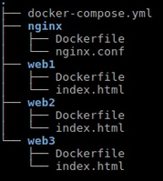
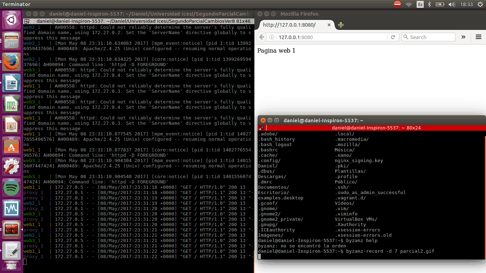

# Distribuidos-Parcial2

# Balanceador de cargas
Balanceador de cargas automatizado 

Daniel Steven Ocampo

A00053980

https://github.com/DanielOcampo23/Distribuidos-Parcial2

# Objetivos

-Realizar de forma autónoma el aprovisionamiento automático de infraestructura

-Diagnosticar y ejecutar de forma autónoma las acciones necesarias para lograr infraestructuras estables

-Integrar servicios ejecutándose en nodos distintos

# Descripción

Deberá realizar el aprovisionamiento de un ambiente compuesto por los siguientes elementos: un servidor encargado de realizar balanceo de carga, tres servidores web con páginas estáticas. Se debe probar el funcionamiento del balanceador realizando peticiones y mostrando servidores distintos atendiendo las peticiones.


# Herramientas

 -Docker
 
 -Docker-compose
 
 -Nginx
 
 -Html (para probar las páginas web)
 
# Procedimiento

Primero configuramos el Dockerfile del nginx para su respectiva instalación, el cual va a ser la herramienta encargada de hacer el balanceo de las web, por eso tenemos que asegurarnos de su funcionamiento antes de configurar las web:

```
FROM nginx

# Remove the default Nginx configuration file
RUN rm /etc/nginx/conf.d/default.conf && rm -r /etc/nginx/conf.d

# Copy a configuration file from the current directory
ADD nginx.conf /etc/nginx/nginx.conf

# Append "daemon off;" to the beginning of the configuration
RUN echo "daemon off;" >> /etc/nginx/nginx.conf

# Set the default command to execute
# when creating a new container
CMD service nginx start
                                 
```

En este Dockerfile se hace los respectivos pasos para poder garantizar su instalación, uno de los pasos importantes es remover el archivo de configuración que viene por defecto del ngnix y remplazarlo por el nuevo que mostraré a continuación, el cual lo llamaremos nginx.conf:

```
http {
    sendfile on;
    upstream app_servers {
        server web1;
        server web2;
        server web3;
    } 
    server {
        listen 80;
        location / {
            proxy_pass         http://app_servers;
            proxy_redirect     off;
            proxy_set_header   Host $host;
            proxy_set_header   X-Real-IP $remote_addr;
            proxy_set_header   X-Forwarded-For $proxy_add_x_forwarded_for;
            proxy_set_header   X-Forwarded-Host $server_name;
        }
    }
}
```

En este archivo configuramos cuales son las web que el ngnix balanceará sin necesidad de especificar el puerto 80 ya que el nginx escucha por el puerto 80, por esta razón no hay necesidad de volverlo a describir.

#  Docker-compose.yml

Después de configurar el dockerfile del nginx, pasamos a configurar el docker-compose.yml el cual es el encargado de montar toda las infraestructura mostrada en el diagrama de deployment anteriormente, este docker-compose debería quedar así con sus respectivas web:

```
version: '2' 
services:
  web1:
    build: ./web1
    volumes:
    - dataWeb1:/usr/local/apache2/htdocs
  web2:
    build: ./web2
    volumes:
    - dataWeb2:/usr/local/apache2/htdocs
  web3:
    build: ./web3
    volumes:
    - dataWeb3:/usr/local/apache2/htdocs
  proxy:
    build: ./nginx
    ports:
    - "8080:80"
    volumes:
    - volNgin:/etc/nginx/volNgin
    
volumes:

    dataWeb1:
    dataWeb2:
    dataWeb3:
    volNgin:
```           

En este docker-compose configuramos los servicios, osea las web que va a balancear el nginx y su respectivo volumen en donde se almacenará, después se configura el proxy (nginx) en el cual se le indica la carpeta en donde esta su respectivo Dockerfile y nginx.config que configuramos en anteriormente, después de esto se describe los puertos del nginx y su volumen.
Por ultimo se mencionan todos los volumenes descritos en todo el docker-compose en el "volumes". Tener cuidado con la identación del último "volumes", por que se pueden producir errores al creer que el "volumes" pertenece a un servicio y no a la descripción de todos los volumenes del archivo.

#  Configuración de las carpetas con sus archivos de las web

Después de mencionar las carpetas de las web en el docker-compose.yml, procedemos a crearlas y configurarlas con sus respectivos archivos:

  -Dockerfile
  -index.html

Para el Dockerfile lo configuraremos de esta manera:

``` 
FROM httpd

#Ubicacion de la index
ADD index.html /usr/local/apache2/htdocs/index.html
```                       
               
En este archivo simplemente mencionamos donde se encuentra el html de la web1

Para el index.hmtl

Simplemente adentro de este archivo escribimos el nombre de la web para diferenciarlo de las demás algo como:
```
Pagina web 1
``` 
Después realizamos lo mismo con las demás web (web2 y web3) para poder tener las tres web requeridas para el balaceo

Las carpetas de la actividad con sus respectivos archivos deberia ser algo como:



#  Ejecución

Finalmente después de haber configurado correctamente todos los archivos antes mencionados, procedemos a ejecutar el docker-compose el cual es el encargado de ejecutar toda la infraestructura como lo mencione anteriormente, para esto ejecutamos el siguiente comando:

```
docker-compose up
```

Prueba de funcionamiento: 



## Cambios en el contenedor

Por último, es pertinente explicar de manera adecuada como realizar cambios en los archivos y poder hacer aplicar los cambios ya que con solamente bajar el Docker no se efecuarán, para esto es necesario eliminar todas las imagenes de esta manera:

```
docker rm $(docker ps -a -q) -f
```
Después ejecutamos 
```
docker-compose build
```
Para poder que lea el Dockerfile con sus nuevos cambios 
Por ultimo ejecutamos nuestro 
```
docker-compose up
```

#  Problematica

Durante la realización de este ejercicio se presentaron una serie de problemas que con el tiempo se fueron solucionando, algunas fueron:

-Aplicar los cambios realizados en el Dockerfile o en cualquier otro archivo, la solución de este problema lo describo anteriomente en "Cambios en el contenedor"
-Otro problema dificil de encontrar fue, la importacia de la identación del archivo docker-compose.yml, ya que si no identamos de manera correcta las etiquetas descritas en este archivo, el sistema puede interpretarlo de otra manera. 
